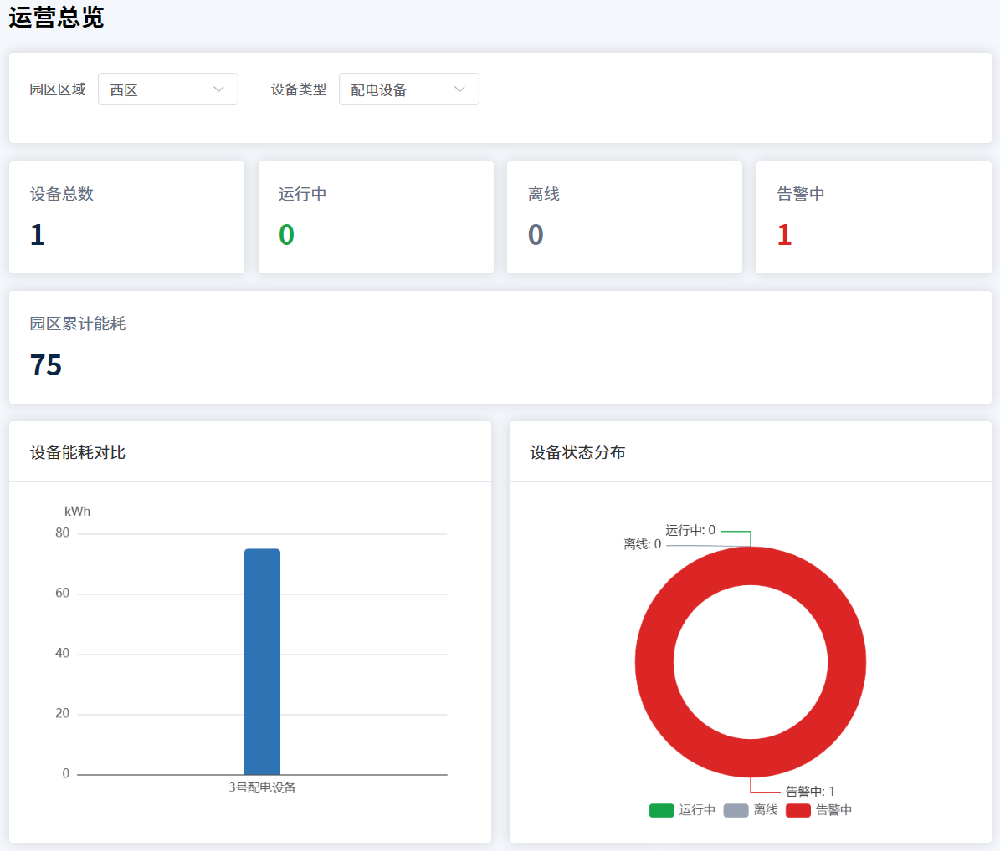

# 智慧园区运营数据可视化平台

基于 Vue 3 的智慧园区运营后台项目，围绕设备监控、能耗分析、工单处理和数据查询等场景，完成从数据展示、条件筛选到业务操作的完整前端流程。

项目使用本地 Mock 数据模拟接口请求，并通过加载、失败和重试状态还原常见的后台系统交互。工单数据保存在浏览器 `localStorage` 中，刷新页面后仍可恢复。

## 核心功能

### 运营总览

- 展示设备总数、运行状态、告警数量和园区累计能耗
- 支持按园区区域、设备类型及其组合条件筛选
- 指标卡、能耗柱状图、状态环形图和健康度仪表盘同步更新
- 展示近 7 日园区能耗趋势
- 点击告警设备后跳转至设备管理页，并自动筛选告警设备

### 设备管理

- 按运行状态筛选设备
- 按设备名称或编号进行关键字搜索
- 支持状态与关键字组合查询
- 通过抽屉查看设备详细信息

### 工单管理

- 新建、编辑和删除工单
- 使用 Element Plus 表单规则校验必填字段
- 自动生成唯一工单编号
- 使用 `localStorage` 保存工单，支持刷新后恢复

### 数据查询

- 按日期范围和设备状态查询记录
- 支持查询条件重置和结果分页
- 模拟异步接口的加载、失败和重新加载状态
- 筛选条件变化后自动返回第一页

## 技术栈

| 类别 | 技术 |
| --- | --- |
| 核心框架 | Vue 3、Composition API |
| 路由管理 | Vue Router |
| UI 组件 | Element Plus |
| 数据可视化 | Apache ECharts |
| 构建工具 | Vite |
| 数据存储 | LocalStorage、本地 Mock 数据 |
| 版本管理 | Git、GitHub |

## 实现亮点

- 使用 `ref`、`reactive` 和 `computed` 管理页面状态、查询参数及派生统计数据
- 通过 `props`、`emit` 和 `watch` 完成父子组件通信及图表数据联动
- 将筛选结果作为统一数据源，同时驱动指标卡、告警列表和多个 ECharts 组件
- 在图表组件中处理初始化、数据更新、窗口缩放和组件卸载，避免重复创建图表实例
- 分离表单输入条件与已提交查询条件，避免输入过程中直接改变查询结果
- 使用表单校验、唯一编号生成和本地持久化完成工单管理闭环
- 编写并执行 21 条功能测试用例，定位并修复 3 个真实缺陷

## 项目结构

```text
smart-park-dashboard/
├─ docs/
│  ├─ images/          项目截图
│  └─ test-cases.md    功能测试与缺陷记录
├─ src/
│  ├─ api/             模拟异步接口
│  ├─ components/      通用组件与图表组件
│  ├─ data/            设备及趋势模拟数据
│  ├─ router/          路由配置
│  ├─ views/           页面级组件
│  ├─ App.vue          根组件
│  └─ main.js          应用入口
├─ package.json
└─ vite.config.js
```

## 本地运行

```powershell
npm install
npm run dev
npm run build
```

## 测试与质量

项目采用手工功能测试验证主要业务流程。

| 测试指标 | 结果 |
| --- | ---: |
| 功能测试用例 | 21 条 |
| 通过用例 | 21 条 |
| 发现缺陷 | 3 个 |
| 已修复并回归 | 3 个 |

详细步骤、预期结果和缺陷分析见 [功能测试与缺陷记录](docs/test-cases.md)。

## 项目截图

### 运营总览




### 设备管理


### 工单管理


### 数据查询


## 数据说明

- 当前设备和趋势数据来自项目内的本地 Mock 数据，并非真实生产接口
- 工单数据存储在当前浏览器的 `localStorage` 中；清理浏览器站点数据后会恢复默认工单
- 项目主要用于展示 Vue 前端开发、数据可视化和功能测试能力

## 后续计划

- 接入真实后端 API，并统一封装请求和异常处理
- 增加登录鉴权、角色权限与操作日志
- 使用 Vitest 或 Playwright 补充自动化测试
- 按需引入 Element Plus 和 ECharts，优化生产构建体积
