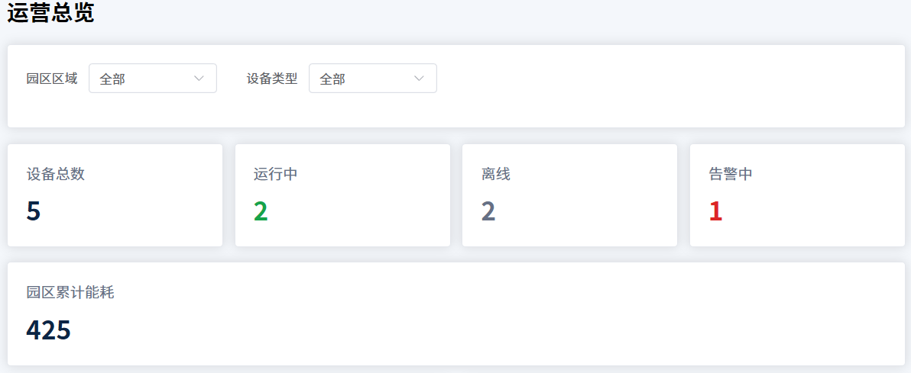
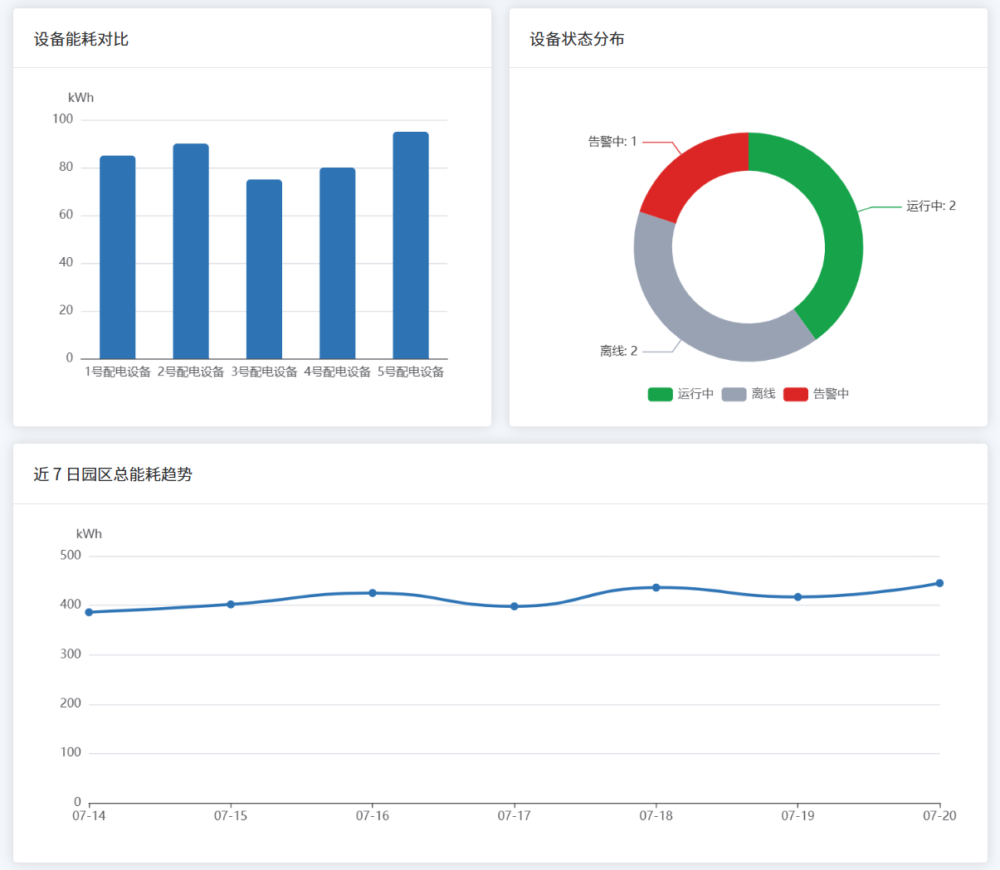
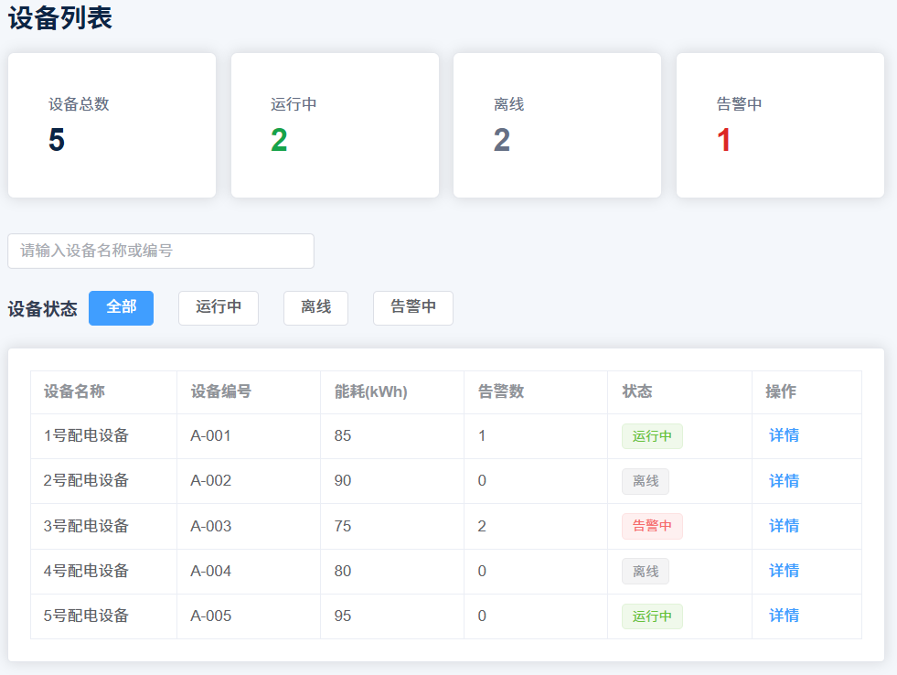
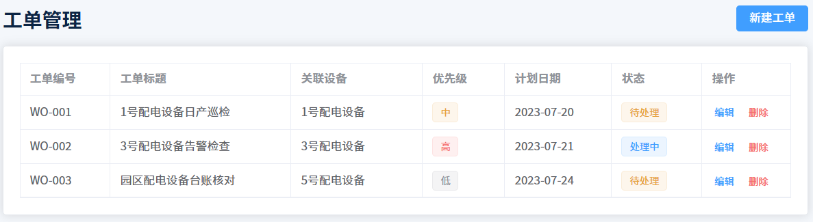
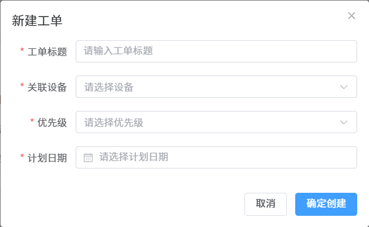
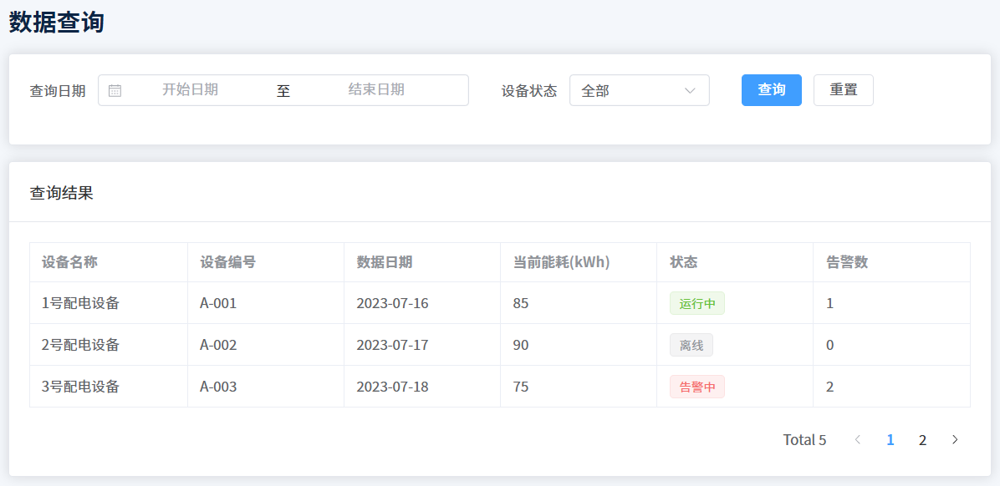

# 智慧园区运营数据可视化平台

基于 Vue 3 的前端可视化学习项目，模拟智慧园区中的设备监控、工单管理和运营数据查询场景。

## 项目功能

- 运营总览：展示设备状态、累计能耗、告警信息和设备健康度
- 筛选联动：支持区域、设备类型及组合筛选，指标卡与图表同步更新
- 数据可视化：设备能耗柱状图、状态环形图、近 7 日趋势图、健康度仪表盘
- 设备管理：状态筛选、关键字搜索、组合查询和设备详情抽屉
- 工单管理：新建、编辑、删除、表单校验、唯一编号及 localStorage 持久化
- 数据查询：日期与状态筛选、分页、异步加载、失败提示和重新加载
- 路由联动：从告警列表跳转设备页，并自动筛选告警设备

## 技术栈

- Vue 3
- Vue Router
- Element Plus
- Apache ECharts
- Vite
- Git

## 项目亮点

- 使用 `computed` 实现多条件筛选和统计数据计算
- 使用 `watch` 驱动 ECharts 图表更新及工单数据持久化
- 通过 `props` 将筛选结果传递给图表组件，实现多组件联动
- 模拟异步接口的加载、失败与重试状态
- 编写并执行 21 条功能测试用例，记录和修复真实缺陷

## 项目结构

```text
src/
  api/          模拟异步接口
  components/   可复用组件和图表组件
  data/         模拟设备与趋势数据
  router/       路由配置
  views/        页面组件
```

## 本地运行

```powershell
npm install
npm run dev
npm run build
```

## 测试记录

功能测试用例与缺陷记录见：[测试用例文档](docs/test-cases.md)。

## 项目截图

### 运营总览




### 设备管理



### 工单管理




### 数据查询

